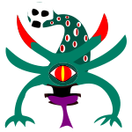

# space-invaders

# Overview

This is my attempt at the video game project from the _The Python Crash Course_.

To up the ante and make the coding a bit more difficult than the book as well as making the project more my own, I am adding different
features than mentioned in the book.

For one, the sprites were all made by me in Inkscape with some inspiration I found online (mainly Pinterest).

For two, I am planning on adding special alien classes that will act as boss fights throughout the game.

# The Characters

#### The base alien (Mob) is this guy...

---

---

#### The mid tier alien (Mushlord) is this guy...

---

---

#### The boss alien (AntlerBoss) is this guy...

---

---

#### And finally the special boss (Titan) is this guy...

---

---

#### Last but not least...

#### The ship!

---

# Progress so Far

So far the game is minimal as I have yet to finish the section from the book.

The base game can be loaded with a minimal (ugly) Game Over screen and Start screen.

The game spawns mob aliens in fleets that you can take out over and over and over again...

So not very fun!

# Future Plans

The plans as of now are to finish up the game logic and make it prettier to look at.

To accomplish this I am going to finish up the _Crash Course_ and add some custom Start and Game Over screens
to spruce up the game a bit. 

Sounds easy right? 

I spent two hours just getting the Game Over screen to not break the game so it will likely be more challenging than I
would like to admit.

# Download

If for whatever reason you wanna download this game for yourself, clone the repo as you normally would and make sure you have
`pygame` installed as it is the only dependency.

The rest of the imports use the `stdlib` so as of now it should be painless to get the game going.

Have fun!